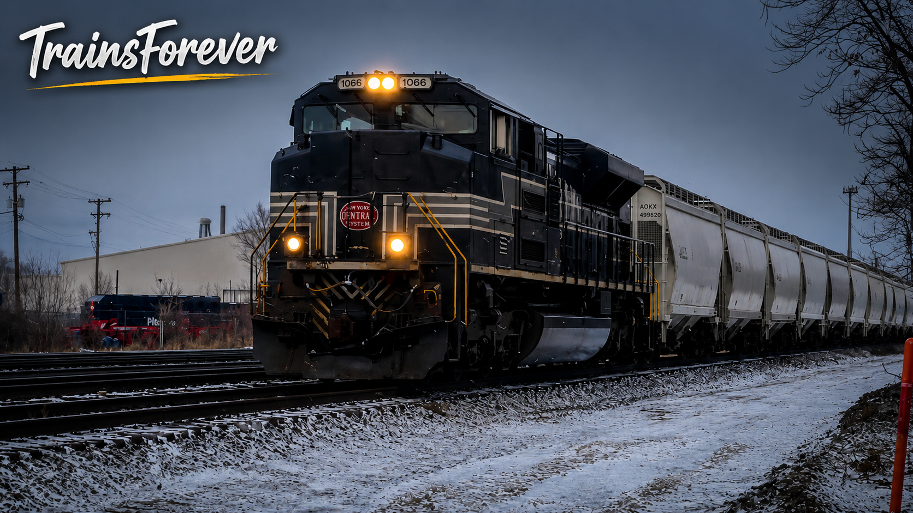

🚂 NS 1066 – New York Central

Welcome to the New York Central Heritage Exhibit.

The New York Central Railroad was one of America’s most historic railroads, connecting major cities across the Northeast and Midwest while playing a significant role in the nation’s transportation history. Today, Norfolk Southern honors that legacy with Heritage Unit NS 1066.

This exhibit documents my personal history with NS 1066, preserving every photograph, video, documented catch, and memory as part of the TrainsForever Archive Museum.

📸 Museum Record

Documented Catches: 7

⸻

🎯 Museum Status

🟢 Complete

✅ Photographed

✅ Video Recorded

✅ Leading Catch Documented

⸻

📊 Museum Statistics

📸 Documented Catches: 7

🚂 Leading Catches: 6

🚃 Trailing Catches: 1

🎥 Archived Videos: 4

📷 Archived Photographs: Updating…

📍 Documented Locations: Updating…

🤝 Railfan Companions: 2

⸻

🎥 Featured YouTube Video

🎬 Watch on YouTube: [🎬 NS 1066 – New York Central Featured Video](https://youtu.be/zICZFHd_c1M)

This featured video documents one of my encounters with NS 1066 – New York Central and has been selected for preservation in the TrainsForever Archive Museum. 
⸻

📷 Featured Photograph

⸻

🤝 Railfan Companions

 Alex, Connor

⸻

📅 Latest Documented Catch

December, 2025. NS Chicago Line. Elkhart yard East entrance. (North Freight)

⸻

📝 Curator’s Notes

NS 1066 has become one of my most frequently documented Norfolk Southern Heritage Unit! most of my documented encounters have been leading catches, making this locomotive one of the most rewarding heritage units in my collection. As I continue documenting NS 1066, this exhibit will grow with additional photographs, videos, locations, and memories.

⸻

⬅️ [Back to Norfolk Southern Heritage Collection](norfolk-southern-heritage.md)
