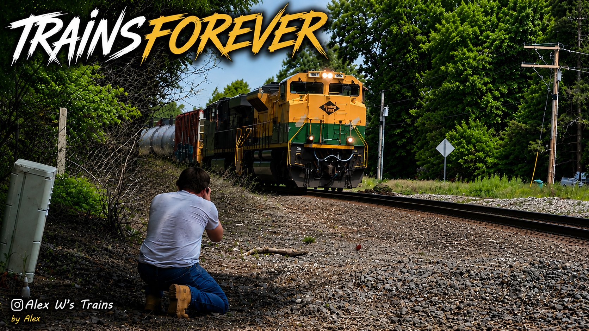
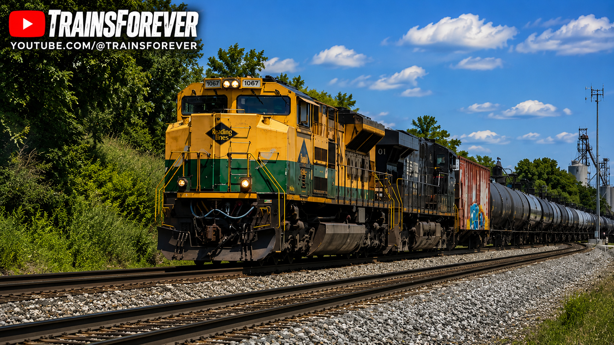

# 🚂 NS 1067 – Reading

Welcome to the Reading Heritage Exhibit.

The Reading Railroad is one of the most recognizable names in American railroad history. Norfolk Southern honors its legacy through Heritage Unit NS 1067.

This exhibit preserves my personal history with NS 1067, documenting every catch, photograph, video, and memory as part of the TrainsForever Archive Museum.

## 📸 Museum Record

**Documented Catches:** 13
## 🎯 Museum Status

🟢 Complete

✅ Photographed

✅ Video Recorded

✅ Leading Catch Documented

## 📊 Museum Statistics

📸 **Documented Catches:** 13

🚂 **Leading Catches:** Verifying..

🚃 **Trailing Catches:** Verifying..

🎥 **Archived Videos:** 5

📷 **Archived Photographs:** Updating...

📍 **Documented Locations:** Updating...

🤝 **Railfan Companions:** Alex

## 🎥 Featured YouTube Video

🎬 **Featured Video:** [Your Video Title](https://youtu.be/G78Q38mW65I)

This video has been selected as the featured recording for the NS 1067 Reading Heritage exhibit.

---

## 📸 Featured Photographs

*Reading Heritage Unit (NS 1067) leading through Leeseburg Indiana NS Marion branch.

📷 Photographer: TrainsForever

🏷️ Railfan Companion: Alex

## 📅 Latest Documented Catch

**May 2023**

The most recent documented catch of NS 1067 occurred in May 2023. 

📝 This section highlights one of the best photographs documenting this locomotive. Each exhibit will feature a different image chosen from my personal archive.

## 📝 Curator's Notes

NS 1067 is currently my most documented Norfolk Southern Heritage Unit, with 13 documented catches. As additional photographs, videos, and memorable encounters are archived, this exhibit will continue to grow as part of the TrainsForever Archive Museum.

⬅️ [Back to Norfolk Southern Heritage Collection](norfolk-southern-heritage.md)
