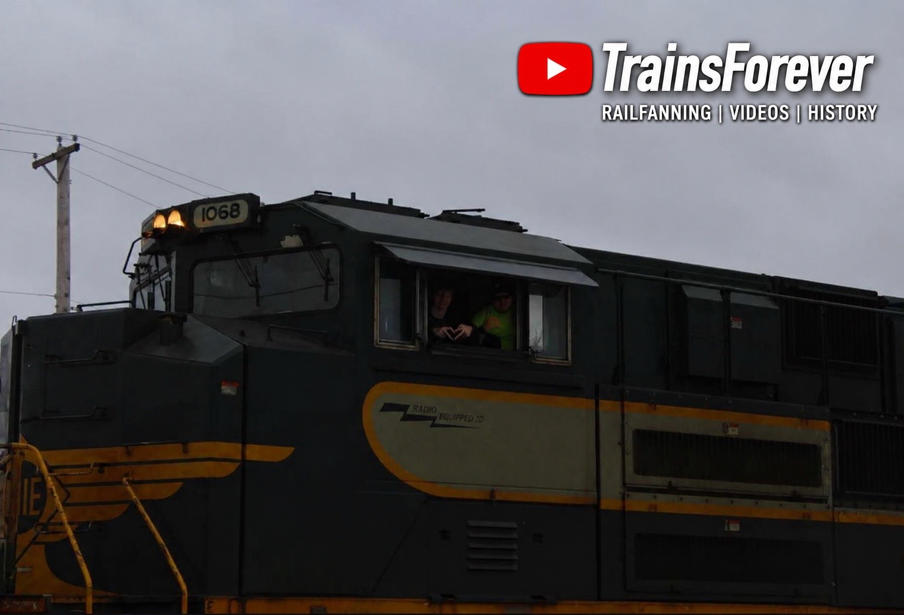
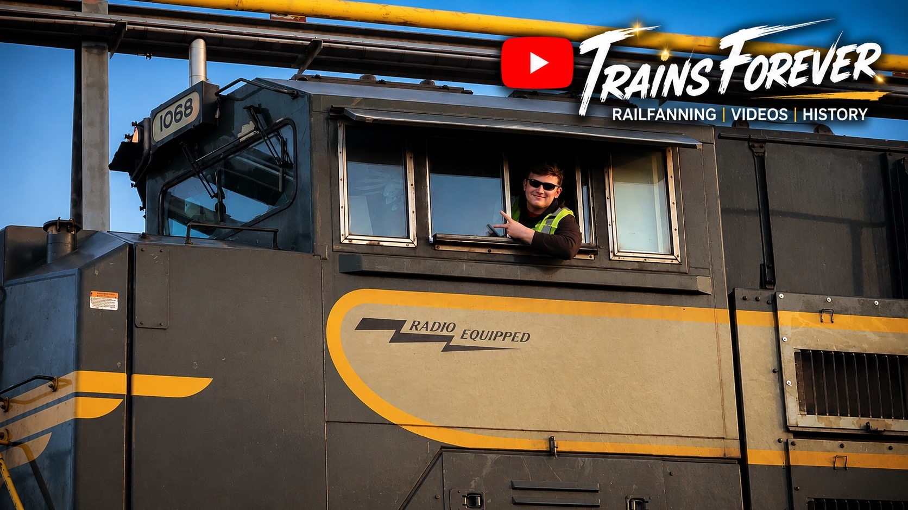

# 🚂 NS 1068 – Erie

Welcome to the Erie Heritage Exhibit.

The Erie Railroad played a significant role in connecting the Midwest and the Northeast, leaving behind a lasting legacy in American railroading. Norfolk Southern honors that legacy through Heritage Unit NS 1068.

This exhibit preserves my personal history with NS 1068, documenting every catch, photograph, video, and memory as part of the TrainsForever Archive Museum.

## 📸 Museum Record

**Documented Catches:** 6

## 🎯 Museum Status

🟢 Complete

✅ Photographed

✅ Video Recorded

✅ Leading Catch Documented

## 📸 Featured Photograph

*Featured Photograph — NS 1068 – Erie during my ride aboard NS 268 from Chicago, Illinois, to Elkhart, Indiana with Conductor Alex. This photograph commemorates one of my most memorable experiences with the Erie Heritage Unit. Photo by: Alex, @Alex W's Trains. 
Alex's Ride aboard NS 1068 on train 268 as well! 

## 🎥 Featured YouTube Video

🎬 **Watch on YouTube:** [NS 1068 – Erie Featured Video](https://youtu.be/b2_6tZPqOSA?is=9iF11M7tnKJTsUpY)

This featured video documents one of my encounters with **NS 1068 – Erie** and has been selected for preservation in the TrainsForever Archive Museum as a representative recording of this heritage unit.

## 📊 Museum Statistics

📸 **Documented Catches:** 7

🚂 **Leading Catches:** 5

🚃 **Trailing Catches:** 2

🎥 **Archived Videos:** 7

📷 **Archived Photographs:** Updating...

📍 **Documented Locations:** Updating...

🤝 **Railfan Companions:** 5

- 💙 Alex
- 💜 Connor
- 🧡 Alex (Spotted on Train)
- 💛 Me & Alex on the train Together
- 🩵 My Specials (me on the train)

## 📝 Curator's Notes

NS 1068 is one of the most recognizable locomotives in the Norfolk Southern Heritage Fleet. As additional photographs, videos, and documented catches are added, this exhibit will continue to grow as part of the TrainsForever Archive Museum.

⬅️ [Back to Norfolk Southern Heritage Collection](norfolk-southern-heritage.md)
