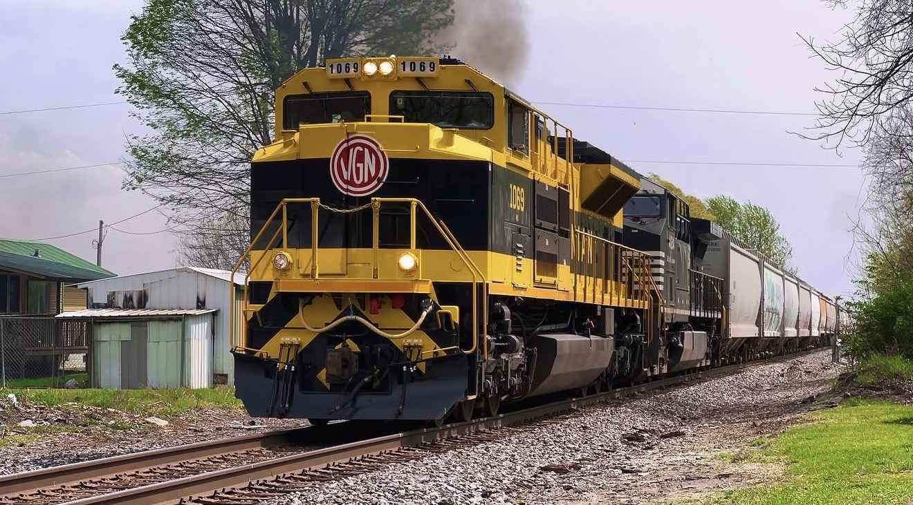

# 🚂 NS 1069 – Virginian

Welcome to the Virginian Heritage Exhibit.

Norfolk Southern Heritage Unit **NS 1069** honors the legacy of the Virginian Railway, a railroad known for its efficient coal operations and commitment to innovation. This exhibit preserves my personal history with NS 1069, documenting every catch, photograph, video, and memory as part of the TrainsForever Archive Museum.

## 📊 Museum Statistics

📸 **Documented Catches:** 4

🚂 **Leading Catches:** 2

🚃 **Trailing Catches:** 2

🎥 **Archived Videos:** 4

📷 **Archived Photographs:** Updating...

📍 **Documented Locations:** Updating...

🤝 **Railfan Companions:** 2

## 📸 Featured Photograph

*Featured Photograph — NS 1069 – Virginian. This image has been selected for preservation in the TrainsForever Archive Museum as a representative photograph of the Virginian Heritage Unit. Photograph by TrainsForever.*

## 🎥 Featured YouTube Video 

## 📝 Curator's Notes

NS 1069 – Virginian is one of Norfolk Southern's 20 original Heritage Units, honoring the historic Virginian Railway. This exhibit preserves my documented encounters with the locomotive through photographs, videos, and personal records.

At the time of this exhibit's publication, I have documented **4 catches**, including **2 leading catches** and **2 trailing catches**. As new photographs, videos, and encounters are recorded, this exhibit will continue to grow as part of the TrainsForever Archive Museum.

Every documented catch helps preserve the history of this heritage unit for future railfans to enjoy.

